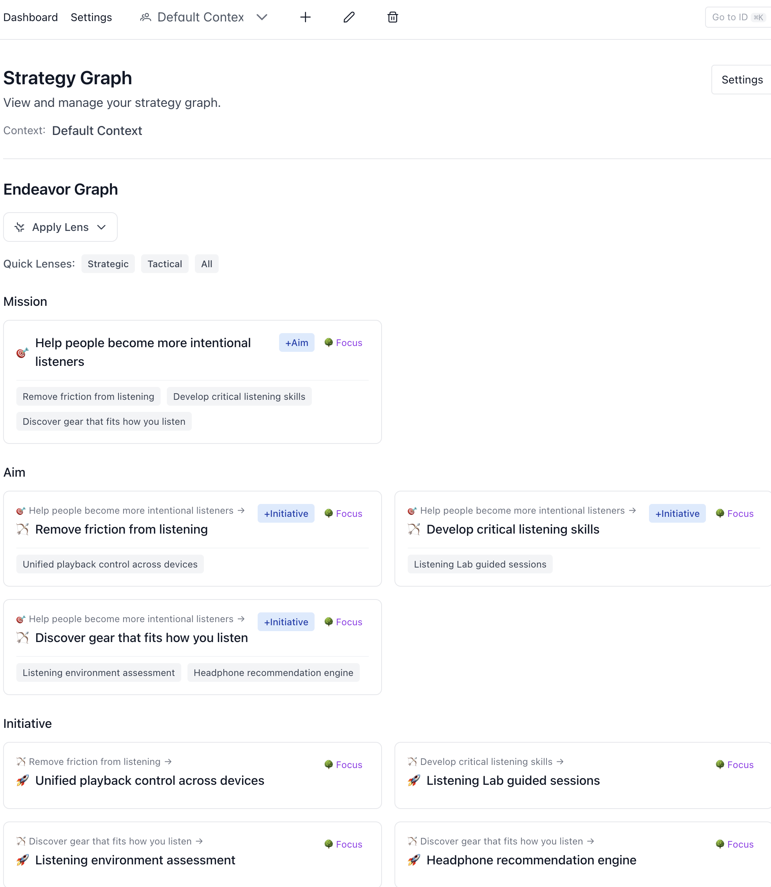

# Open Horizons

A self-hostable strategy graph for aligning work to organizational strategy.



## Quick Start

```bash
docker compose up
```

Open [http://localhost:3000](http://localhost:3000).

For development with hot reload:

```bash
docker compose -f docker-compose.dev.yml up
```

## What is this?

Open Horizons models your organization's strategy as a directed graph. Nodes represent units of work at different levels of abstraction -- missions, aims, initiatives -- and edges encode the relationships between them. The graph is displayed as a navigable tree, giving teams a shared view of how daily execution connects to strategic intent.

The built-in MCP endpoint lets AI agents read and traverse your strategy graph, so tools like Claude, Cursor, or custom agents can ground their work in organizational context without manual copy-paste.

No authentication is required. Open Horizons is designed to run on your own infrastructure, behind your own network boundary.

## Features

- **Strategy graph** -- Tree visualization of your full strategic hierarchy, from mission down to tasks or outcomes.
- **Configurable node types** -- Choose a preset or define your own hierarchy. Ship with two built-in presets.
- **MCP endpoint** -- JSON-RPC API at `/api/mcp` for AI agent integration. Agents can list, search, and traverse the graph.
- **Markdown import** -- Import strategy documents as structured graph nodes.
- **REST API** -- Full CRUD for endeavors, edges, contexts, and dashboard data.
- **Docker deployment** -- Single `docker compose up` brings up the app and Postgres.

## Configuration

### Environment Variables

| Variable | Default | Description |
|---|---|---|
| `DATABASE_URL` | (set by Docker Compose) | PostgreSQL connection string |
| `STRATEGY_PRESET` | `open-horizons` | Active node type hierarchy |

### Configurable Node Type Hierarchy

Node types are data, not code. Configure them entirely through the UI at **Settings > Node Types**, or via the `/api/node-types` API.

Each node type has:
- **Name and slug** -- Display name and URL-safe identifier
- **Icon and color** -- Emoji icon and hex color for visual distinction
- **Valid children/parents** -- Advisory relationships for UI hints (not enforced at the DB level)
- **Sort order** -- Position in the hierarchy (top = strategic, bottom = tactical)

The graph itself is flexible -- any node can connect to any other node via edges. The hierarchy is a lens, not a constraint.

**Built-in presets** can be loaded with one click from the Node Types settings page:

**Open Horizons** (default):
```
Mission > Aim > Initiative > Task
```

**Agentic Flow** (for AI-native workflows -- strategy only, execution belongs in delivery tools):
```
Mission > Strategic Bet > Capability > Outcome Spec
```

**Via API:**
```bash
# List current node types
curl http://localhost:3000/api/node-types

# Create or update a node type
curl -X POST http://localhost:3000/api/node-types \
  -H "Content-Type: application/json" \
  -d '{"slug":"bet","name":"Bet","description":"A strategic wager","icon":"🎲","color":"#dc2626","valid_children":["capability"],"valid_parents":["mission"],"sort_order":1}'

# Load a preset (atomic replace)
curl -X POST http://localhost:3000/api/node-types/load-preset \
  -H "Content-Type: application/json" \
  -d '{"nodeTypes":[...]}'
```

The dashboard, lens filters, and child creation buttons all derive dynamically from the node types in the database. No restart required after changes.

## API

### REST Endpoints

| Method | Path | Description |
|---|---|---|
| GET | `/api/dashboard` | Full graph for the dashboard |
| GET | `/api/endeavors/:id` | Get a single endeavor |
| POST | `/api/endeavors/create` | Create an endeavor |
| PATCH | `/api/endeavors/:id` | Update an endeavor |
| DELETE | `/api/endeavors/:id` | Delete an endeavor |
| GET/POST | `/api/edges` | List or create edges |
| GET/POST | `/api/contexts` | List or create contexts |
| GET/POST/DELETE | `/api/node-types` | Manage node type hierarchy |
| POST | `/api/node-types/load-preset` | Atomic preset replacement |
| GET/POST | `/api/metis` | List or create metis entries (patterns/insights) |
| GET/POST | `/api/guardrails` | List or create guardrails (constraints/rules) |
| GET/POST | `/api/candidates` | List or create candidates (proposed metis/guardrails) |
| POST | `/api/candidates/:id/promote` | Promote a candidate to metis or guardrail |
| POST | `/api/candidates/:id/reject` | Reject a candidate |
| GET | `/api/endeavors/:id/extensions` | Get metis + guardrails for an endeavor |
| GET | `/api/status` | Health check |

### MCP (JSON-RPC)

`POST /api/mcp` accepts JSON-RPC 2.0 requests. Available methods:

- `list_endeavors` -- List endeavors with optional filters (`context_id`, `node_type`, `limit`).
- `get_endeavor` -- Get an endeavor and its children by `id`.
- `get_tree` -- Get the full tree for a `context_id`.
- `search_endeavors` -- Full-text search by `query`.
- `list_metis` -- List metis entries for an `endeavor_id`.
- `list_guardrails` -- List guardrails for an `endeavor_id`.
- `create_candidate` -- Create a candidate with `endeavor_id`, `type`, and `content`.
- `get_extensions` -- Get metis + guardrails for an `endeavor_id`.

Example:

```bash
curl -X POST http://localhost:3000/api/mcp \
  -H "Content-Type: application/json" \
  -d '{"jsonrpc":"2.0","id":1,"method":"get_tree","params":{"context_id":"default"}}'
```

### Using with oh-mcp-server

The [oh-mcp-server](https://github.com/open-horizon-labs/oh-mcp-server) connects AI agents (Claude, etc.) to your strategy graph via MCP stdio transport. Point it at your local instance:

```bash
OH_API_URL=http://localhost:3000 OH_API_KEY=dummy npx oh-mcp-server
```

No real API key is needed -- the OSS version has no authentication. Any non-empty string works as `OH_API_KEY` (the MCP server requires it on startup but the app ignores it).

For Claude Desktop, add to your `claude_desktop_config.json`:

```json
{
  "mcpServers": {
    "open-horizons": {
      "command": "npx",
      "args": ["oh-mcp-server"],
      "env": {
        "OH_API_URL": "http://localhost:3000",
        "OH_API_KEY": "dummy"
      }
    }
  }
}
```

## Development

```bash
pnpm install
pnpm dev          # Start dev server on http://localhost:3000
pnpm build        # Production build (includes contract validation)
pnpm test         # Run unit tests
pnpm lint         # Lint
```

Requires Node 20+ and pnpm.

## Architecture

```
app/
  api/              Next.js API routes (REST + MCP)
  (pages)           Next.js app router pages
lib/
  config/           Node type presets (fallback when DB is empty)
  contracts/        Zod schemas for request/response validation
  db.ts             Postgres connection pool (pg)
  graph/            Graph traversal utilities
db/
  schema.sql        Database schema (loaded by Docker on init)
  seed.sql          Seed data
```

Built with Next.js 15, React 19, TypeScript, PrimeReact, Tailwind CSS, and PostgreSQL.

## License

MIT
